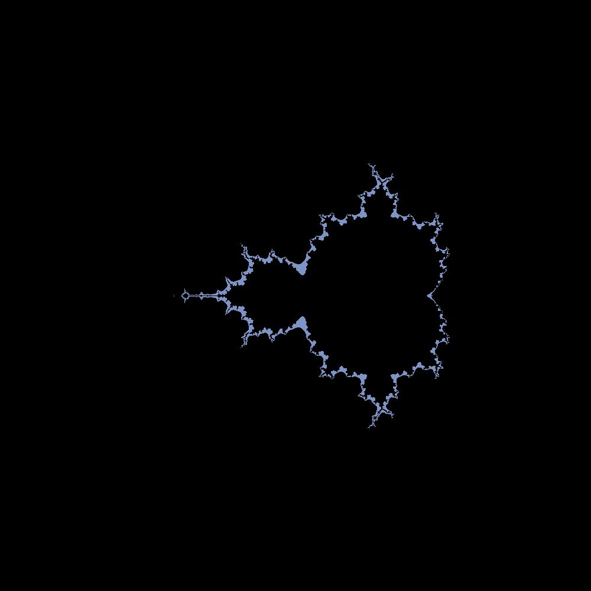

# newtonfractal
Some code to draw a cartesian plane and do complex arithmetic I might have use for later, the graphics could be optimized but its progress  
Includes Newton–Raphson method and code to draw a newton fractal as well as a mandelbrot fractal  
 
 
